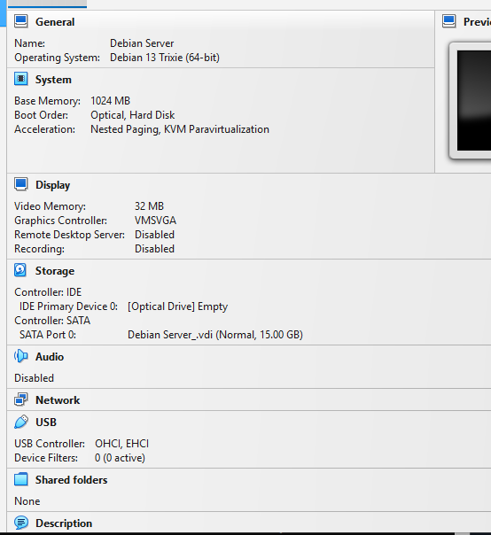
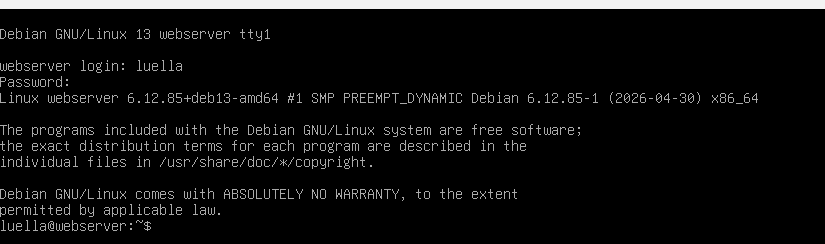
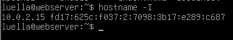
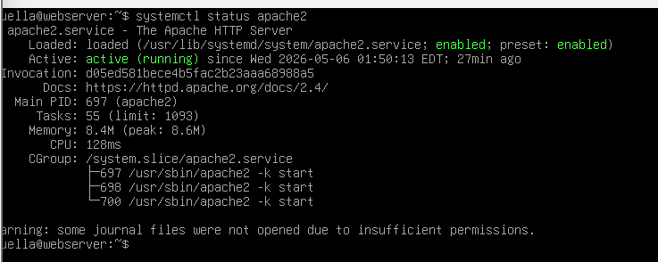
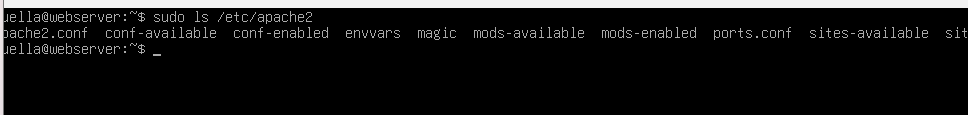
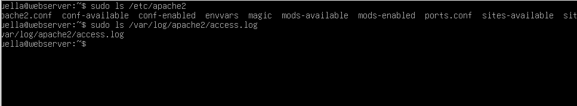
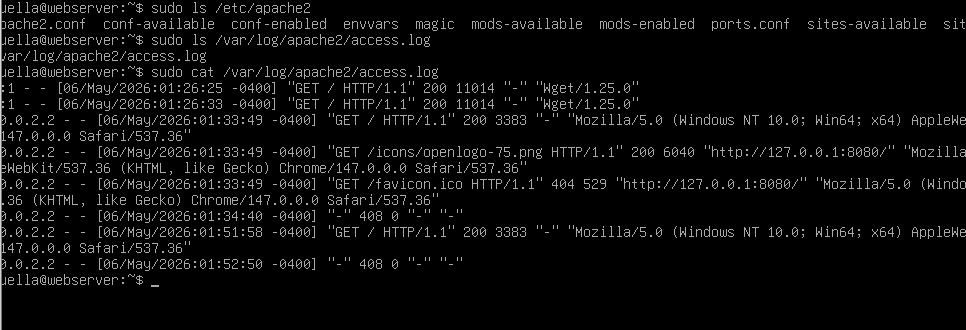

# Part 2 of Project

---

## What are the server hardware specifications?

---

## What is the Debian Login Screen?

---

## What is the IP address of your Debian Server VM?

---

## How do you work with the Firewall in Debian? 

### How do you check if the Firewall is running?
To check if the firewall is running, you can run the command:
`sudo ufw status`

### How do you disable the Firewall?
To disable the firewall, you can run the command
`sudo ufw disable`

### How do you add Apache to the Firewall?
To add Apache to the firewall you must run the following two commands
`sudo ufw allow 'WWW Full'`
`sudo ufw allow 'OpenSSH'` 

--- 

## What different commands do we use to work with Apache?

### systemctl status apache2 
This command is used to check if Apache is enabled and running.

### sudo systemctl start apache2 
This command is used to start the web server.

### sudo systemctl stop apache 2
This command is used to stop the web server.

### sudo systemct1 restart apache2 
This command stops and then restarts the web server.

### sudo apachectl configtest
This command is used to test the Apache configuration.
~[ApacheTestConfig](apacheConfigTest.png)

### sudo apache2 -v
This command is used to check the version of Apache.

---

## What are some common configuration files for Apache?
Common configuration files for  Apache appear to be 
- htaccess (per-directory configuration file)
- httpd.conf: (primary configuration file for Apache web server)
- apache2.conf: (same purpose as httpd:conf but for Debian conventions)

---

## Where does Apache store logs?
Apache stores logs in
`/var/log/apache2/access.log` - by Default
Apache also stores error logs in
`/var/log/apache2/error.log`

---

## What are some commands we can use to review logs?
The easiest command to view our logs is 
`sudo cat /var/log/apache2/access.log`
and you can replace access.log with error.log for the error logs.

You can use 
`sudo tail /var/log/apache2/access.log`
If you wish to view the most recent entries in the log files.

---