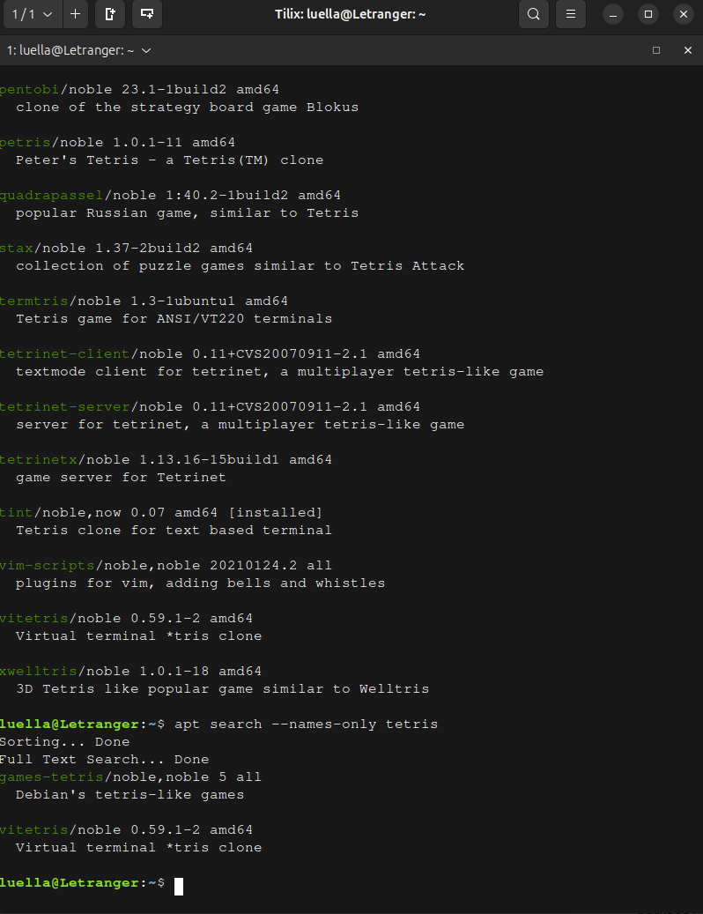
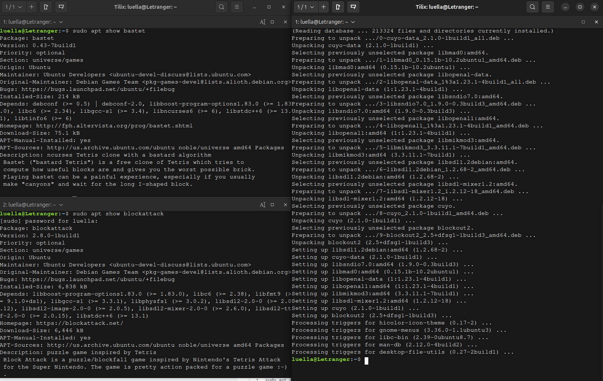
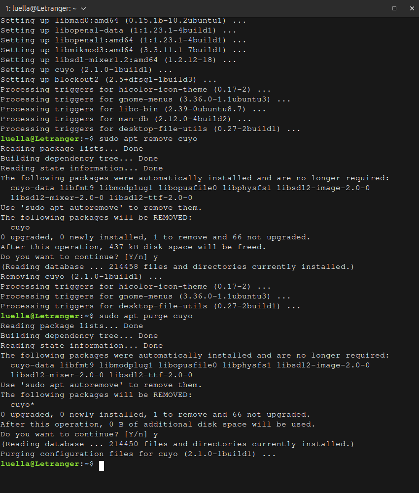
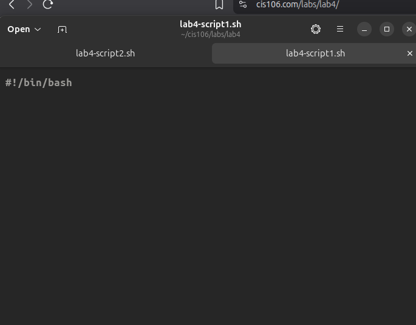
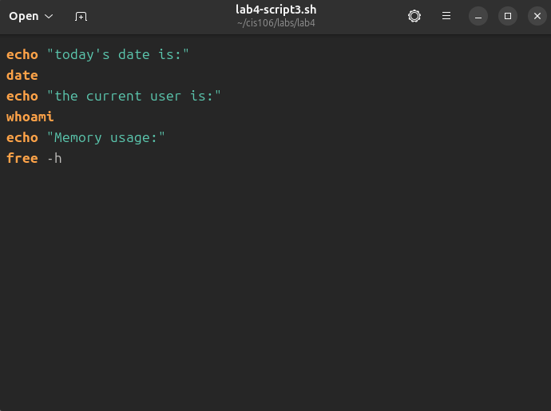
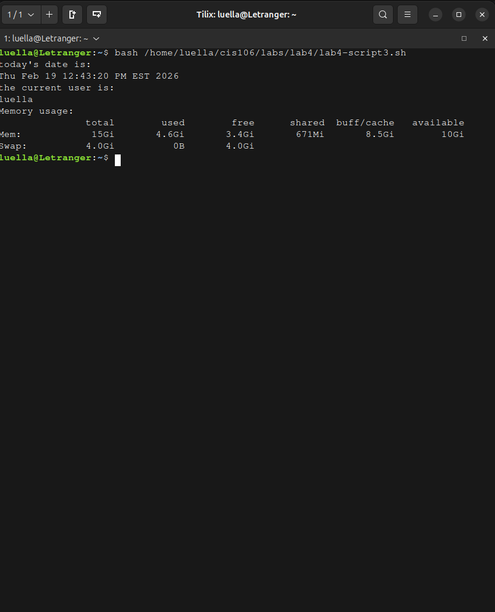
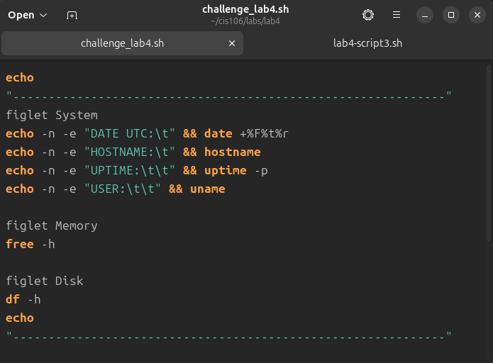
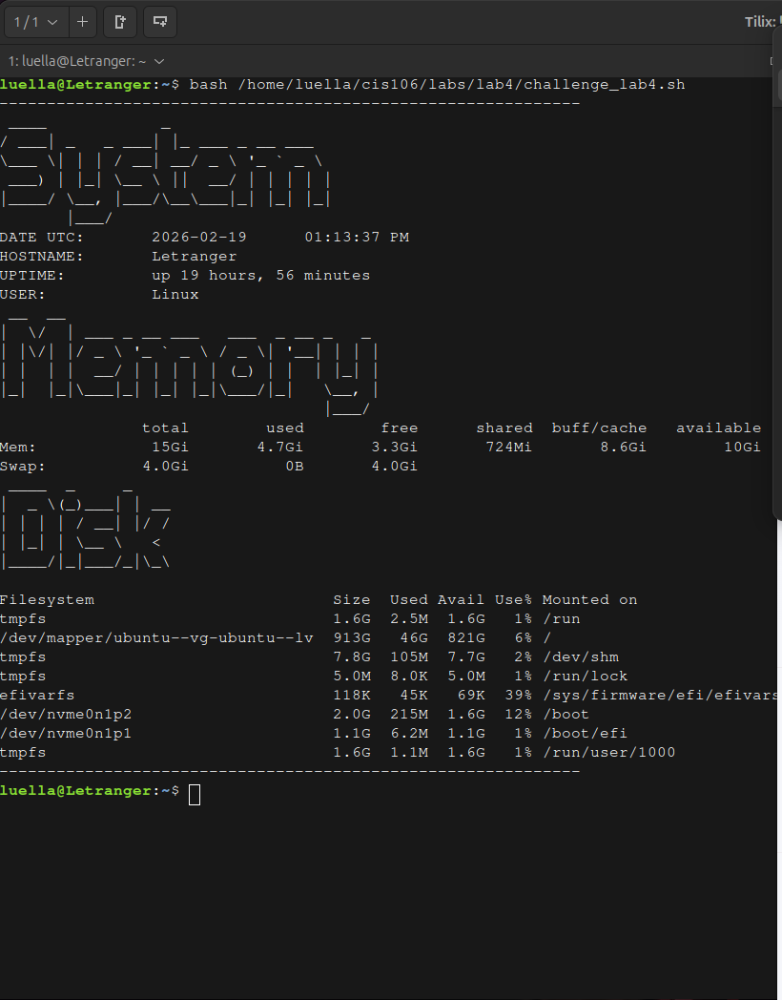

# Question 1
## Question 1.1

## Question 1.2

## Question 1.3

## Question 1.4

# Question 2
## Question 2.1

## Question 2.2

## Question 2.3

## Question 2.4

# Question 3 (Challenge Question)
## Question 3.1

## Question 3.2

