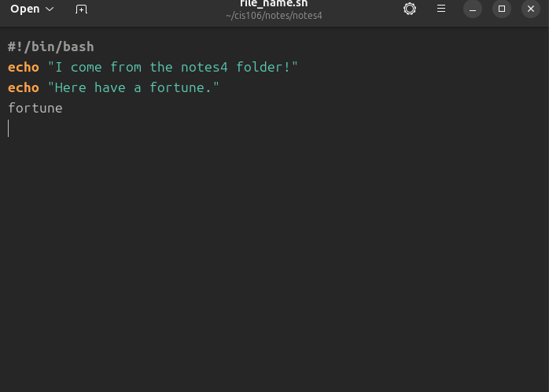
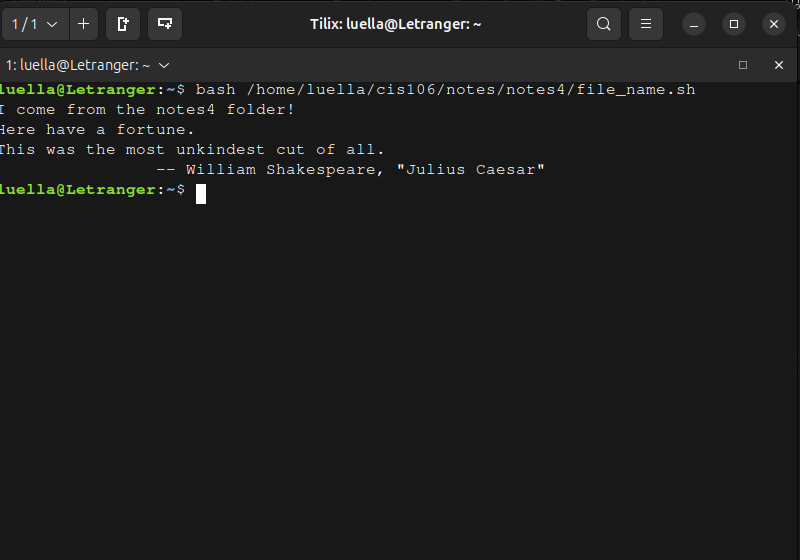

# How to install and remove software using the APT command.

* To install software you need  to follow this formula on the command line.
  * `sudo + apt + install + package name`

* If you wanted to remove software using the APT command you'd follow this formula (replace `install` with `remove`)
  * `sudo + apt + remove + package name`

## A few examples of these two
* `sudo apt install firefox flameshot caffeine -y`
* `sudo apt remove firefox flameshot caffeine -y`
* You can also install and remove at the same time on one command line
  * `sudo apt install firefox+ flameshot- caffeine- vlc+`
    * The reason this can work is because when you add a - to the end of a package name, it effectively runs `remove` when that's applied. 
  * `sudo apt purge firefox+ flameshot- caffeine- vlc+`
    * This purges programs and removes all remaining files/traces of said programs within the system.

# How to create a shell script step by step including screenshots and how to run it. Try to be as detailed as possible.

1. Open a text editor. (I will be using "text editor") Then rename the file to file_name.sh (for this example.)
2. The first line in the file must be the shebang or shell interpreter. If it were bash it'd be #!/bin/bash
3. The script should be commands that you want to run in the shell.

4. Then to run the script use the following command in your interpreter/terminal you must use
   * bash /path/to/script/script_name.sh
     * In this case ***I*** use /home/luella/cis106/notes/notes4/file_name.sh 
