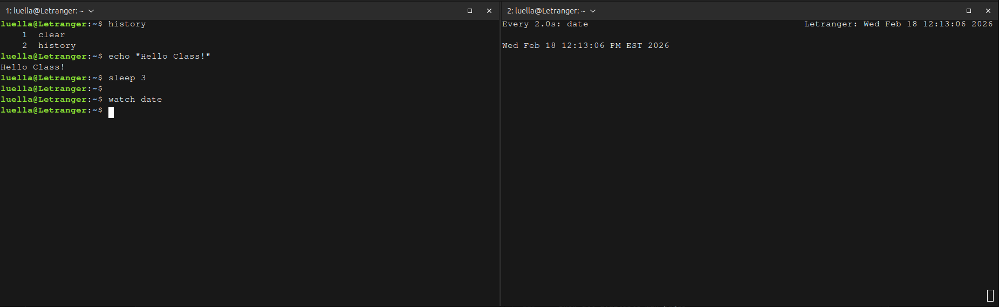
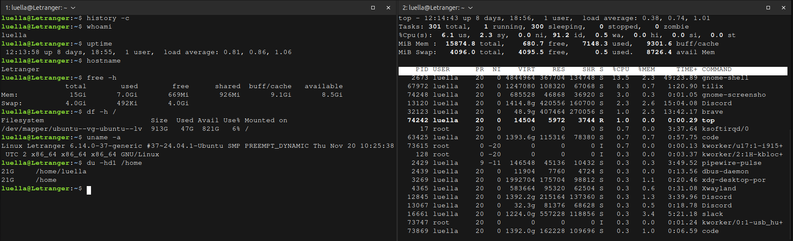
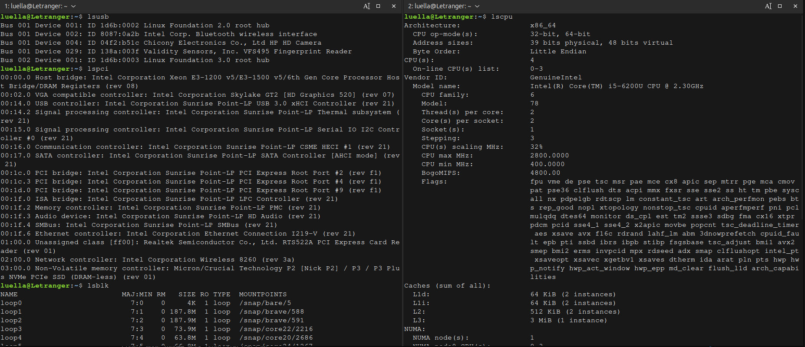
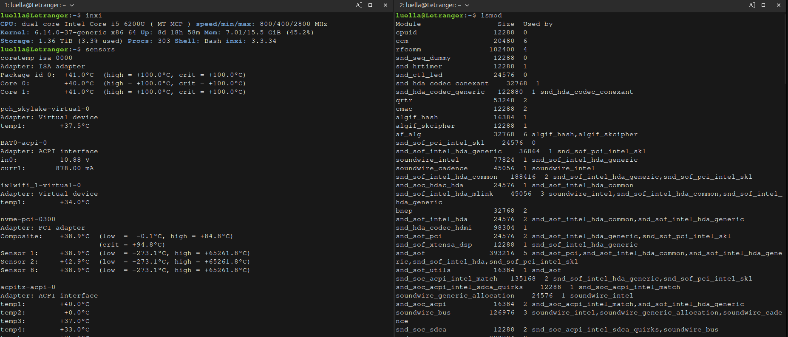
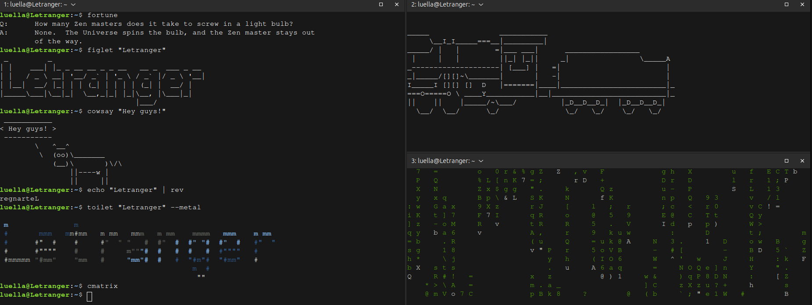
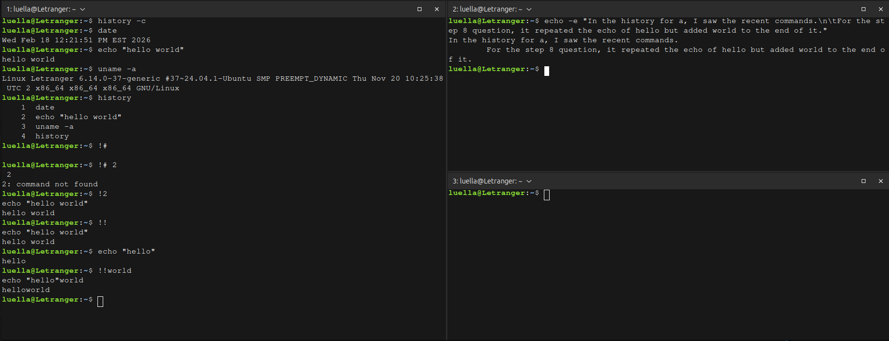
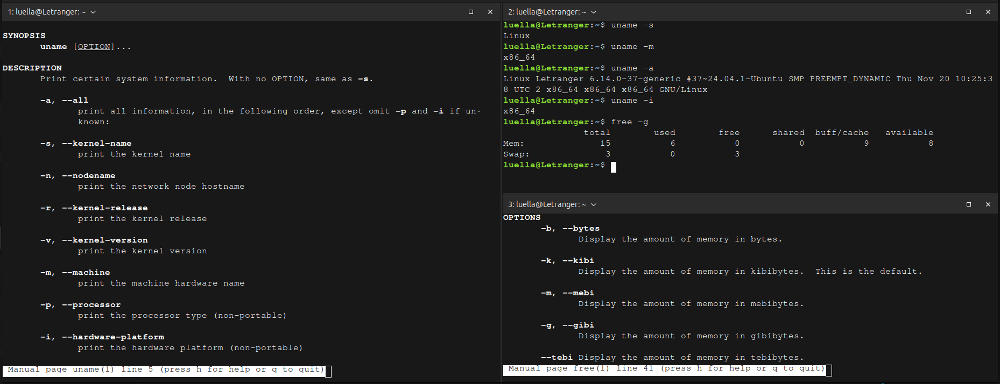
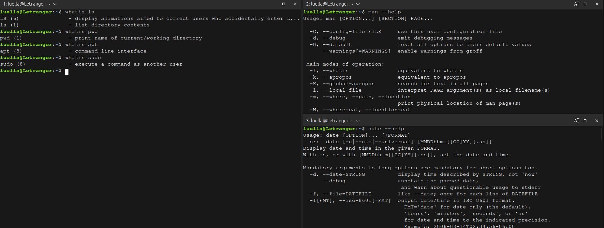
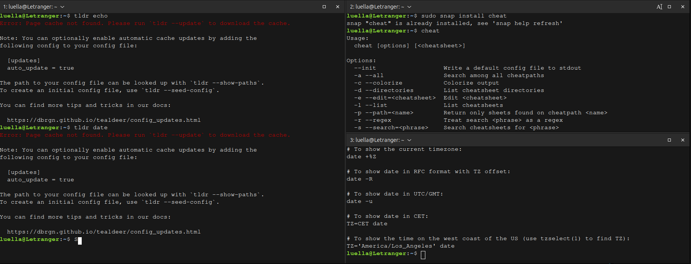
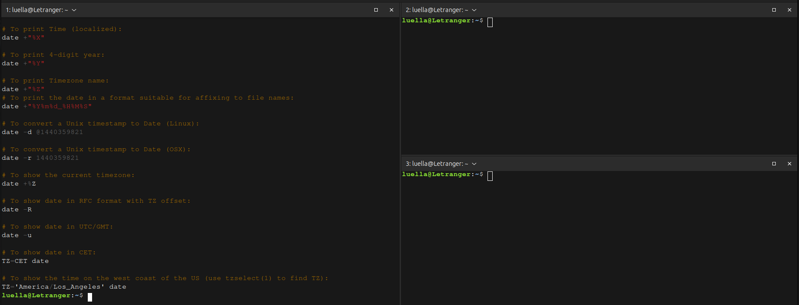

# Week Report 3

## Completed work for week 3

[notes3.md](https://github.com/Arikjuan/cis106/blob/main/notes/notes3/notes3.md)

[lab3.md](https://github.com/Arikjuan/cis106/blob/main/labs/lab3/lab3.md)

## Practice Screenshots
### Practice 3

### Practice 4

### Practice 5

### Practice 6

### Practice 7

### Practice 8

### Practice 9

### Practice 10

